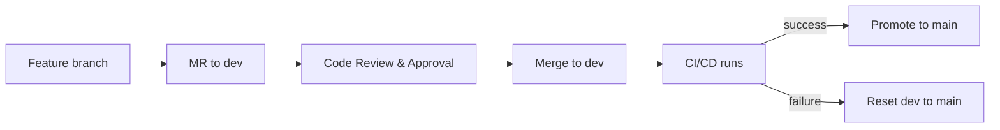
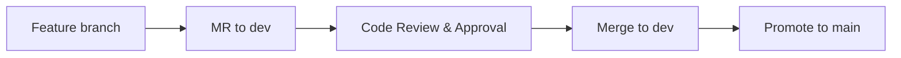

# GitLab CI/CD Multi-Workflow Pipeline

## Purpose
This repository provides a changeset-driven CI/CD pipeline designed to serve mixed-purpose repositories, such as a Git-synced Snowflake Workspace that may include different types of workloads under a single repo. These workloads can include Snowflake notebook projects, dbt transformation projects, Database Change Management (DCM) projects, and more. Each project type lives in its own folder and has its own isolated workflow that triggers only when files in that folder change. Users can also define custom workflows for any additional workload type that doesn't fit the built-in categories, making the pipeline extensible to whatever the team needs to deploy.

## Operating Model

### Ground Rules
* development only happens in feature branches
* both the `main` and `dev` branches are protected
* developers must open a Merge Request (MR) to merge changes to `dev` which requires a code review
* `CODEOWNERS` enforces code review by group per project folder, with more granular control can be assigned to specific person(s)
* once approved, merge changes into `dev` which will trigger smoke tests
* `main` is the ultimate source of truth — only promoted automatically by CI after all stages pass using the version in `dev`
* if CI fails on `dev`, the branch is hard-reset back to `main` version

### Branch Protection Rules
These settings must be configured in GitLab (Settings > Repository > Protected branches) to enforce the ground rules:

* **Default branch:**
  * Set `dev` as the default MR target branch (Settings > Repository > Branch defaults)
* **`dev` branch:**
  * Protected — require merge request for all changes
  * Allowed to merge: Developers and above
  * Allowed to push: only the CI bot token (for rollback reset)
  * Allow force push: only the CI bot token
  * Not allowed to delete
  * Enable "Require CODEOWNERS approval" under Settings > Repository > Protected branches
  * Each section in `CODEOWNERS` maps to a required approval group
  * For more granular control, add specific file paths or glob patterns within a section and assign individual users (e.g. `notebooks/sales_forecast/** @jane @bob`)
* **`main` branch:**
  * Protected — no one can push directly
  * Allowed to push: only the CI bot token (`GITLAB_CI_BOT_USER`)
  * Allowed to merge: no one (merges happen only via CI promote stage)
  * No force push allowed
  * Not allowed to delete

### Workflow Design



* developers create feature branches and open merge requests targeting `dev`
* code owners review and approve based on `CODEOWNERS` rules
* merging to `dev` triggers the CI/CD pipeline
* on success, `main` is fast-forwarded to `dev`
* on failure, `dev` is hard-reset back to `main`

### Concurrency Control

Two mechanisms work together to prevent race conditions when multiple merges happen in quick succession:

**Auto-cancel redundant pipelines** — when a newer commit is pushed to `dev`, GitLab automatically cancels any running pipeline for the older commit. The newer pipeline tests the combined changes. This must be enabled in GitLab:

1. Go to Settings > CI/CD > General pipelines
2. Enable "Auto-cancel redundant pipelines"

**Resource group** — both `promote_to_main` and `rollback_dev` share a `resource_group` (`deploy_pipeline`), which ensures only one pipeline's promote or rollback runs at a time. If auto-cancel doesn't catch an overlap, promote/rollback jobs are queued instead of running concurrently.

**Interruptible stages** — all workflow stages (detect, validate, deploy, execute) are marked `interruptible: true`, allowing GitLab to gracefully cancel them mid-job when a newer pipeline supersedes them. Promote and rollback are not interruptible.

## Code Owners

### Approval Hierarchy

GitLab automatically enforces code review requirements using the `CODEOWNERS` file at the repository root. When a merge request is opened:

* GitLab identifies which files were changed and matches them against patterns in `CODEOWNERS`
* Each matched section requires at least one approval from the designated group
* A single MR can require approvals from multiple groups if it touches files across different sections
* Approvals are enforced — the MR cannot be merged until all required groups have approved
* For more granular control, specific file paths or glob patterns can be assigned to individual users within a section (e.g. `notebooks/sales_forecast/** @jane @bob`)


### Governance Cadence

| Section | Group | Scope |
|---|---|---|
| Repo Admin | `@Repo-Admin` | `*.md`, `CODEOWNERS` |
| Dev Ops | `@Dev-Ops` | `.gitlab-ci.yml`, `ci/**/*` |
| Custom Project | `@Custom-Project` | `custom-projects/**/*` |
| DCM Projects | `@DCM-Projects` | `dcm-projects/**/*` |
| dbt Projects | `@dbt-Projects` | `dbt-projects/**/*` |
| Notebooks | `@Notebooks` | `notebooks/**/*` |

For example, if a file is moved from `notebooks/` to `custom-projects/`, the MR touches both folders. GitLab requires approval from both `@Notebooks` and `@Custom-Project` before the merge can proceed, ensuring both the source and destination project owners sign off on the change.

## Workflow Triaging
The root `.gitlab-ci.yml` acts as the triage layer. It inspects which folders were modified in the commit and conditionally includes only the relevant workflow files. This means:

* each project type has its own workflow with independent stages
* a commit that only touches `notebooks/` will only run the notebook workflow — dbt, dcm, and custom jobs are not loaded at all
* a commit that touches multiple folders (e.g. `notebooks/` and `dbt-projects/`) will include all affected workflows, and jobs from different workflows in the same stage run in parallel
* if a commit touches no project folders (e.g. only `README.md`), no workflows are included but promote still runs to fast-forward the change to `main`
* adding a new workload type is as simple as creating a new workflow folder under `ci/`, a corresponding project folder at the root, and a new `include:rules:changes` entry in `.gitlab-ci.yml`

### Repository Structure

```
.gitlab-ci.yml                    # <-- this is the entry point
CODEOWNERS                        # <-- assigns code owner groups
ci/
  variables.yml
  snowflake-config.toml           # <-- empty connection stubs for Snowflake CLI
  no-deployment.yml
  promote.yml
  rollback.yml
  nb/
    workflow.yml
    workflow.md
    scripts/...
    stages/...
  dbt/...
  dcm/...
  custom/...
notebooks/
  notebook_manifest.yml
  sales_forecast/...
  churn_scoring/...
dbt-projects/...
dcm-projects/...
custom-projects/...
```

### Workflow Triggering

The root `.gitlab-ci.yml` uses `include:rules:changes` to conditionally include workflows based on which folders have changes in the commit:

```yaml
  - local: 'ci/custom/workflow.yml'
    rules:
      - changes:
          - custom-projects/**/*
```

| Folder changed | Workflow triggered |
|---|---|
| `notebooks/**/*` | `ci/nb/workflow.yml` |
| `dbt-projects/**/*` | `ci/dbt/workflow.yml` |
| `dcm-projects/**/*` | `ci/dcm/workflow.yml` |
| `custom-projects/**/*` | `ci/custom/workflow.yml` |

If a single commit touches multiple folders, all relevant workflows run in parallel within shared stages.

### No-Deployment Workflows

When a commit touches no project folders (e.g. only `README.md`, `CODEOWNERS`, or CI config files), no workflow-specific stages are included. However, `ci/no-deployment.yml` is always included as the last entry in the root `.gitlab-ci.yml`, which brings in `ci/promote.yml` and `ci/rollback.yml`, so the pipeline still runs:

1. The MR is reviewed and merged to `dev`
2. No detect, validate, or deploy stages run — there is nothing to deploy
3. The promote stage runs immediately, fast-forwarding `main` to `dev`

This ensures non-project changes (documentation, CI configuration, code owner updates, etc.) are not stranded on `dev` and always reach `main`.



Rollback is included as a safety net in case the promote step itself fails (e.g. network or authentication error). In practice this should never happen — it is included as good practice.

### Shared CI Components

#### `ci/variables.yml`
Shared variables used by promote and rollback jobs:
* `CI_BOT_EMAIL` / `CI_BOT_NAME` — git identity for CI bot commits

The branch names are configured as GitLab CI/CD variables (Settings > CI/CD > Variables):
* `GITLAB_DEV_BRANCH` — CI trigger branch name (e.g. `dev`)
* `GITLAB_MAIN_BRANCH` — protected branch name (e.g. `main`)

> These two variables must **not** be marked as Protected. The `workflow:rules` in `.gitlab-ci.yml` evaluates `$GITLAB_DEV_BRANCH` on every push to decide whether to create a pipeline. Protected variables are only injected on protected branches, so on a feature branch the variable would be undefined and the pipeline would run unexpectedly.

#### `ci/snowflake-config.toml`
Minimal Snowflake CLI configuration file containing empty connection stubs (`[connections.dev]` and `[connections.prod]`). This file is deployed to `~/.snowflake/config.toml` by the Snowflake CI/CD Component at the start of each Snowflake-using job. The empty stubs register the connection names so that `SNOWFLAKE_CONNECTIONS_DEV_*` and `SNOWFLAKE_CONNECTIONS_PROD_*` environment variables can supply the actual parameters (account, user, role, etc.) as overrides at runtime.

#### Snowflake CI/CD Component

Workflows that interact with Snowflake use the official [Snowflake CI/CD Component for GitLab](https://docs.snowflake.com/en/developer-guide/snowflake-cli/cicd/gitlab-component) (`snowflake-dev/snowflake-cicd-component`) to install and configure the Snowflake CLI. The component is included once per workflow with `template-only: true`, which exposes a hidden job template (`.configure-snowflake-cli`). Each job that needs the `snow` CLI uses `extends: .configure-snowflake-cli` to inherit the setup.

What the component handles automatically in each job's `before_script`:
1. Installs the `uv` Python package manager
2. Installs the Snowflake CLI via `uv tool install snowflake-cli`
3. Copies `ci/snowflake-config.toml` to `~/.snowflake/config.toml` with `0600` permissions

Authentication uses **key-pair auth** with the existing `SNOWFLAKE_CONNECTIONS_DEV_*` / `SNOWFLAKE_CONNECTIONS_PROD_*` GitLab CI/CD variables. No changes to the Snowflake service account or GitLab variable setup are needed.

Example workflow include:
```yaml
include:
  - component: $CI_SERVER_FQDN/snowflake-dev/snowflake-cicd-component/configure-snowflake-cli@1.1.0
    inputs:
      template-only: true
      default-config-file-path: ci/snowflake-config.toml
```

Example job:
```yaml
nb_deploy_to_dev:
  extends: .configure-snowflake-cli
  script:
    - snow sql --connection dev -q "..."
```

#### `ci/no-deployment.yml`
Always included as the last entry in the root `.gitlab-ci.yml`. Defines the `promote` and `rollback` stages and includes `ci/promote.yml` and `ci/rollback.yml`. Ensures promote/rollback stages are always last in the merged stage order.

#### `ci/promote.yml`
Runs after all workflow stages pass (or immediately if no workflows trigger). Fast-forwards `GITLAB_MAIN_BRANCH` to `GITLAB_DEV_BRANCH` via `git push`. Retries up to 2 times on failure before rollback kicks in.

#### `ci/rollback.yml`
Runs on any pipeline failure. Hard-resets `GITLAB_DEV_BRANCH` back to `GITLAB_MAIN_BRANCH` via `git push --force`.

For workflow-specific documentation, see each workflow's `workflow.md`:
* [Notebook Workflow](ci/nb/workflow.md)
* [DCM Workflow](ci/dcm/workflow.md)
* [dbt Workflow](ci/dbt/workflow.md)
* [Custom Workflow](ci/custom/workflow.md)
