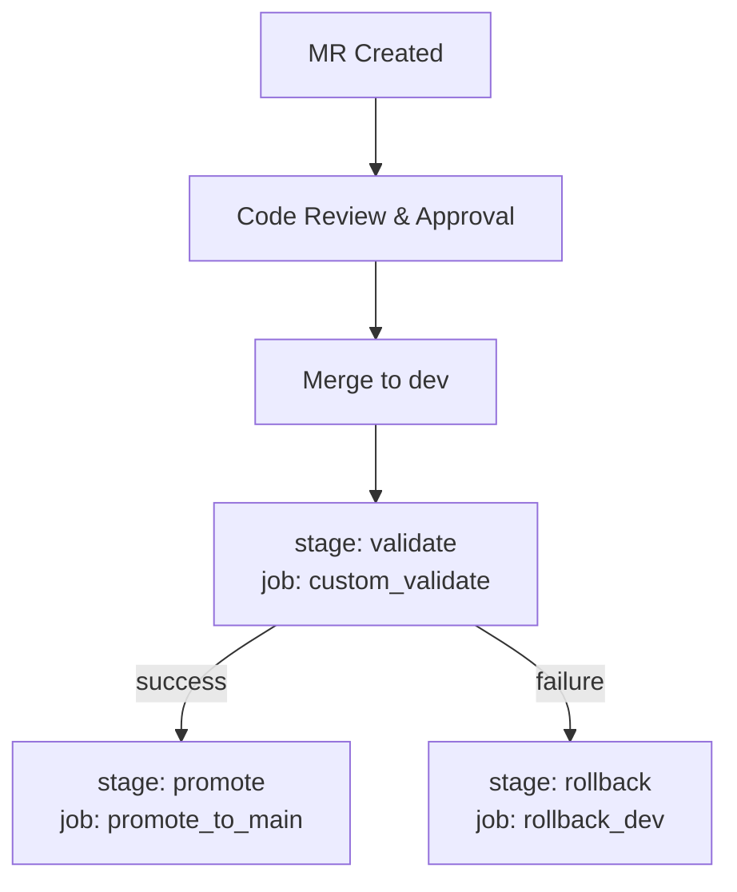

# Custom Workflow

Triggered by changes to `custom-projects/**/*`.

```mermaid
flowchart TD
    MR["MR Created"] --> Review["Code Review & Approval"]
    Review --> MergeDev["Merge to dev"]
    MergeDev --> Validate["stage: validate\njob: custom_validate"]
    Validate -->|success| Promote["stage: promote\njob: promote_to_main"]
    Validate -->|failure| Rollback["stage: rollback\njob: rollback_dev"]
```
