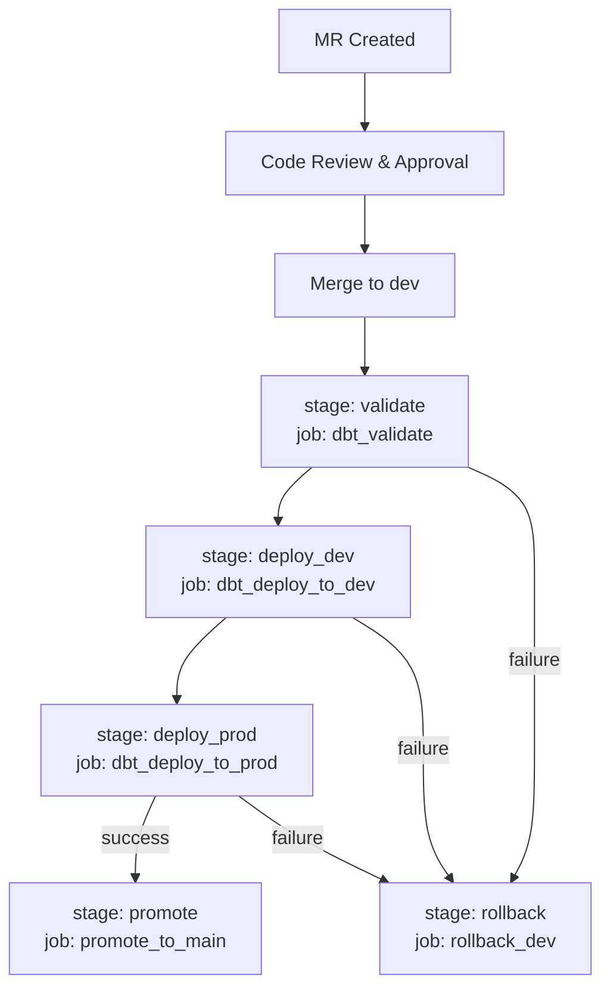

# dbt Workflow

Triggered by changes to `dbt-projects/**/*`.

```mermaid
flowchart TD
    MR["MR Created"] --> Review["Code Review & Approval"]
    Review --> MergeDev["Merge to dev"]
    MergeDev --> Validate["stage: validate\njob: dbt_validate"]
    Validate --> DeployDev["stage: deploy_dev\njob: dbt_deploy_to_dev"]
    DeployDev --> DeployProd["stage: deploy_prod\njob: dbt_deploy_to_prod"]
    DeployProd -->|success| Promote["stage: promote\njob: promote_to_main"]
    Validate -->|failure| Rollback["stage: rollback\njob: rollback_dev"]
    DeployDev -->|failure| Rollback
    DeployProd -->|failure| Rollback
```
