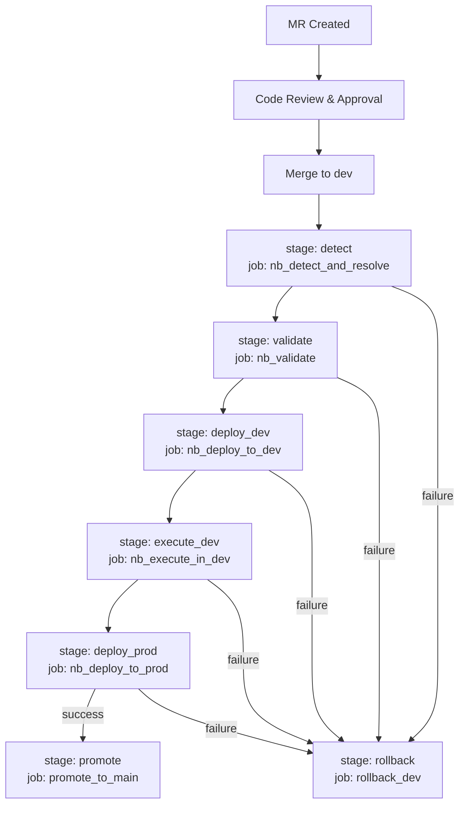

# Notebook Workflow

The notebook workflow is the most mature workflow.

## Environment Setup

* DEV and PROD are separate Snowflake accounts
* Object names (databases, schemas, stages, notebook projects) are identical across both accounts
* The only difference between environments is the Snowflake connection — each account has its own CLI connection (`SNOWFLAKE_CONNECTION_DEV` / `SNOWFLAKE_CONNECTION_PROD`)
* The manifest stores unqualified object names (e.g. `NOTEBOOK_STAGE`, `SALES_FORECAST_NPO`) and the pipeline constructs fully qualified names at runtime using the project's `database` and `schema` fields
* Shared defaults (`DEFAULT_SNOWFLAKE_NOTEBOOK_*` CI/CD variables) apply to both environments — no need for separate DEV/PROD default variables since the object names match
* Per-project overrides can be defined in the manifest under `deploy` and `execute` blocks when a project needs different settings from the defaults

## Workflow Stages
1. **detect** — diffs the commit, filters to `notebooks/`, maps changed paths to manifest projects using the changeset strategy below
2. **validate** — verifies main_file exists, validates `.ipynb` as JSON, compiles `.py` files
3. **deploy_dev** — uploads project files to the DEV Snowflake stage, creates/refreshes the DEV Notebook Project
4. **execute_dev** — executes the notebook in DEV as a smoke test gate
5. **deploy_prod** — uploads project files to the PROD Snowflake stage, creates/refreshes the PROD Notebook Project (no execution)
6. **promote** — fast-forwards `GITLAB_MAIN_BRANCH` to `GITLAB_DEV_BRANCH`
7. **rollback** — resets `GITLAB_DEV_BRANCH` to `GITLAB_MAIN_BRANCH` on failure

## Changeset Strategy

The detect stage splits the git diff into two categories using `--diff-filter`:

* **Non-deleted files** (added, modified, renamed) — matched strictly against the manifest. Every file must belong to a registered project folder, or the pipeline fails.
* **Deleted files** — matched leniently. If a deleted file belongs to a project, that project is redeployed without the file. If a deleted file is outside any project folder, it is silently ignored.

This allows users to clean up orphan/legacy files without blocking the pipeline, while still enforcing that all new or modified files are properly registered.

### Changeset rules

| Change type | Inside a project folder | Outside any project folder |
|---|---|---|
| Added/Modified | Deploy that project | **Reject** — must be in a registered project |
| Deleted | Deploy that project (without the deleted file) | **Ignore** — cleanup is allowed |

### Edge cases

| Scenario | Behavior |
|---|---|
| Delete an orphan file (e.g. `notebooks/test.py`) | Ignored — not in any project, no error |
| Delete a file inside a project (e.g. `notebooks/sales_forecast/old.py`) | `sales_forecast` is redeployed without the deleted file |
| Delete an entire project folder | All files match the project → project flagged for deployment → deploy fails because folder is gone. User must also remove the project from the manifest. |
| Delete project folder AND remove manifest entry in same commit | Deleted files no longer match any project → silently ignored. Clean removal. |
| Add a file outside any project (e.g. `notebooks/scratch.py`) | **Rejected** — must be inside a registered project folder |
| Only orphan deletions, no other changes | No projects affected → empty `affected_projects.json` → child pipeline succeeds → parent promotes |
| Modify `notebook_manifest.yml` | Flagged as manifest change, skipped from project matching |

## Notebook Manifest
`notebooks/notebook_manifest.yml` maps each notebook project to its deployment targets:
* `project_name` — project identifier
* `project_path` — folder path under `notebooks/`
* `main_file` — entry point file
* `deploy` block — deployment targets:
  * `database` — Snowflake database name (shared across dev and prod)
  * `schema` — Snowflake schema name (shared across dev and prod)
  * `stage` — Snowflake stage name (unqualified, prefixed at runtime by `database.schema`)
  * `notebook_project` — Notebook Project name (unqualified, prefixed at runtime by `database.schema`)
* `execute` block — execution parameters (optional, falls back to CI/CD variables):
  * `compute_pool` — compute pool for notebook execution
  * `query_warehouse` — query warehouse
  * `runtime` — notebook runtime version
  * `requirements_file` — Python dependencies file
  * `arguments` — JSON arguments passed to the notebook
  * `external_access_integrations` — list of external access integrations
  * `secrets` — list of secrets

**Required fields:** `project_name`, `project_path`, and `main_file` must be defined for every project. These have no fallback.

**Optional fields:** Everything under `deploy` and `execute` is optional. If omitted, the pipeline falls back to `DEFAULT_SNOWFLAKE_NOTEBOOK_*` GitLab CI/CD variables. A project can omit both blocks entirely to use all defaults, or selectively override individual fields.

## GitLab CI/CD Variables

### Resolution order
Values are resolved in this order:
1. manifest field (top-level per project)
2. GitLab CI/CD variable (used as fallback when the manifest field is omitted)

For `stage` and `notebook_project`, the manifest stores unqualified object names.
The `database` and `schema` fields from the manifest (or `DEFAULT_SNOWFLAKE_NOTEBOOK_DATABASE` /
`DEFAULT_SNOWFLAKE_NOTEBOOK_SCHEMA` CI/CD variables as fallback) are prepended at runtime to
construct the fully qualified name.

### Environment-specific variables
| Usage | DEV | PROD |
|---|---|---|
| Connection name (passed to scripts) | `SNOWFLAKE_CONNECTION_DEV` | `SNOWFLAKE_CONNECTION_PROD` |
| Account identifier | `SNOWFLAKE_CONNECTIONS_DEV_ACCOUNT` | `SNOWFLAKE_CONNECTIONS_PROD_ACCOUNT` |
| Service account user | `SNOWFLAKE_CONNECTIONS_DEV_USER` | `SNOWFLAKE_CONNECTIONS_PROD_USER` |
| Role | `SNOWFLAKE_CONNECTIONS_DEV_ROLE` | `SNOWFLAKE_CONNECTIONS_PROD_ROLE` |
| Warehouse | `SNOWFLAKE_CONNECTIONS_DEV_WAREHOUSE` | `SNOWFLAKE_CONNECTIONS_PROD_WAREHOUSE` |
| Authenticator | `SNOWFLAKE_CONNECTIONS_DEV_AUTHENTICATOR` | `SNOWFLAKE_CONNECTIONS_PROD_AUTHENTICATOR` |
| Private key (raw PEM) | `SNOWFLAKE_CONNECTIONS_DEV_PRIVATE_KEY_RAW` | `SNOWFLAKE_CONNECTIONS_PROD_PRIVATE_KEY_RAW` |

The `SNOWFLAKE_CONNECTIONS_<NAME>_*` variables are read directly by the Snowflake CLI — no config file is needed. See [Snowflake Connection Setup](../../docs/snowflake-connection.md) for full setup instructions.

### Default variables (fallback when manifest field is omitted)
| Usage | Variable Key | Example Value | Manifest field |
|---|---|---|---|
| Snowflake database | `DEFAULT_SNOWFLAKE_NOTEBOOK_DATABASE` | `SANDBOX` | `deploy.database` |
| Snowflake schema | `DEFAULT_SNOWFLAKE_NOTEBOOK_SCHEMA` | `PUBLIC` | `deploy.schema` |
| Deployment stage name | `DEFAULT_SNOWFLAKE_NOTEBOOK_STAGE` | `NOTEBOOKS` | `deploy.stage` |
| Notebook Project name | `DEFAULT_SNOWFLAKE_NOTEBOOK_NPO` | `DEFAULT_NPO` | `deploy.notebook_project` |
| Compute pool | `DEFAULT_SNOWFLAKE_NOTEBOOK_COMPUTE_POOL` | `CP_XS` | `execute.compute_pool` |
| Query warehouse | `DEFAULT_SNOWFLAKE_NOTEBOOK_QUERY_WAREHOUSE` | `WH_XS` | `execute.query_warehouse` |
| Notebook runtime version | `DEFAULT_SNOWFLAKE_NOTEBOOK_RUNTIME` | `V2.6-CPU-PY3.12` | `execute.runtime` |

### Shared variables
| Usage | Variable |
|---|---|
| Dev branch name | `GITLAB_DEV_BRANCH` |
| Main branch name | `GITLAB_MAIN_BRANCH` |
| Manifest file path | `NOTEBOOK_MANIFEST_FILE` |
| GitLab bot user for promote/rollback | `GITLAB_CI_BOT_USER` |
| GitLab bot token for promote/rollback | `GITLAB_CI_BOT_TOKEN` |

## Workflow Diagram

Triggered by changes to `notebooks/**/*`.

